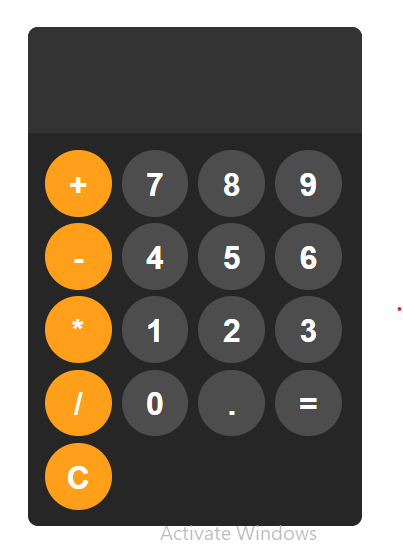

# Calculator App 🧮

A modern and responsive calculator application built with **React**, **TypeScript**, and **Tailwind CSS**, focusing on clean UI design, accurate arithmetic logic, and strong type safety.

## 🔗 Live Demo
[Calculator App Site](https://fr1nk5sh.github.io/Calculator_App/)

## 📸 Screenshot


## 🛠️ Tech Stack
- React
- TypeScript
- Tailwind CSS
- Vite

## ✨ Features
- Basic arithmetic operations (addition, subtraction, multiplication, division)
- Clear and reset functionality
- Real-time input and result updates
- Responsive layout for mobile and desktop
- Clean, minimal, and user-friendly interface

## 🧠 What I Learned
- Managing UI and application state with React hooks
- Implementing calculator logic while handling edge cases
- Writing strongly typed React components with TypeScript
- Structuring components for readability and maintainability
- Styling efficiently using utility-first CSS (Tailwind)

## 🚀 Getting Started

To run this project locally:

```bash
git clone https://github.com/Fr1nk5sh/Calculator_App.git
cd calculator-app
npm install
npm run dev
